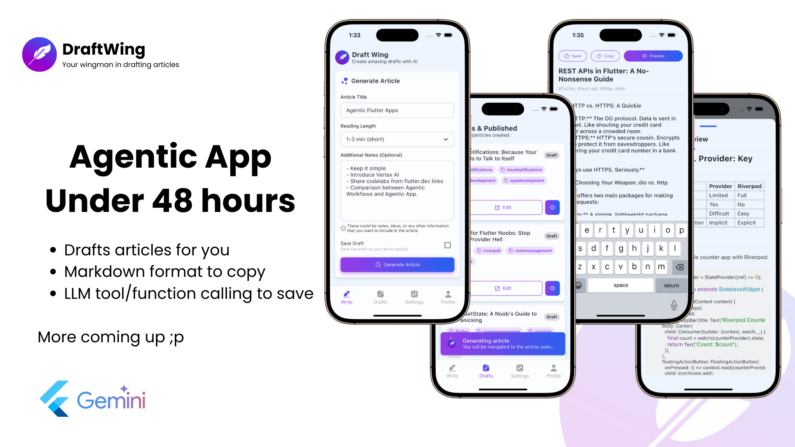
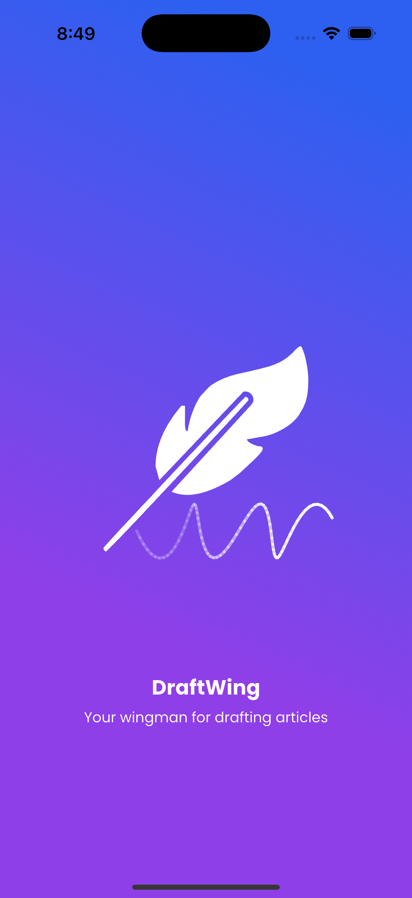
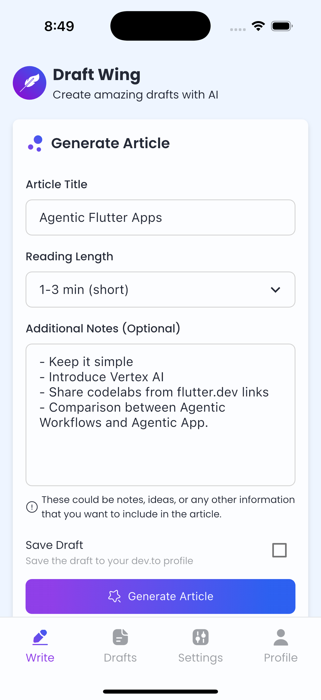
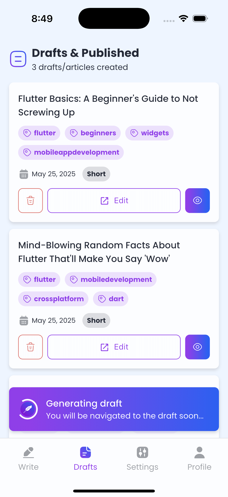
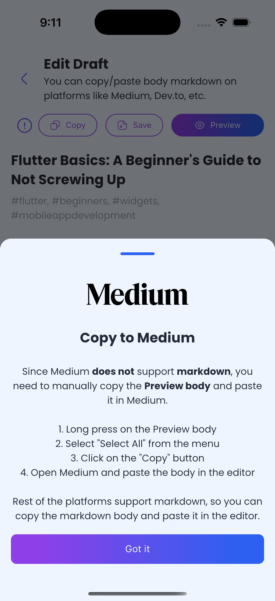
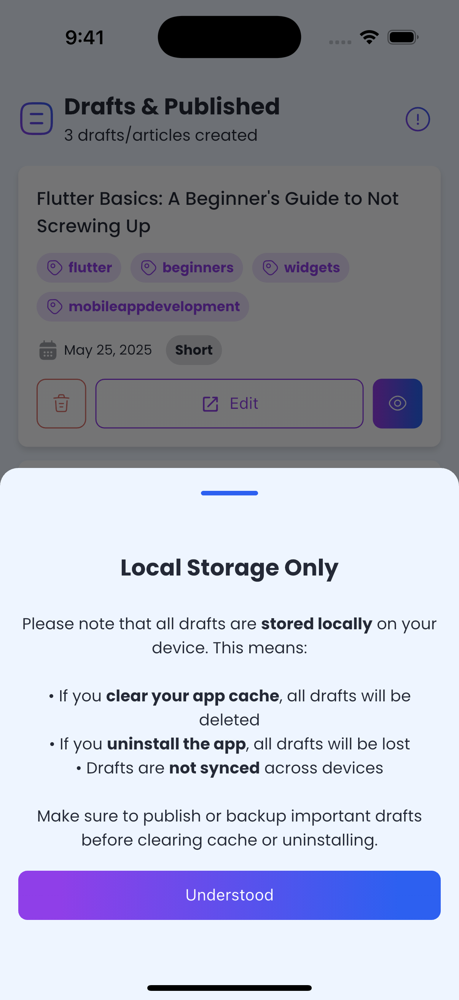
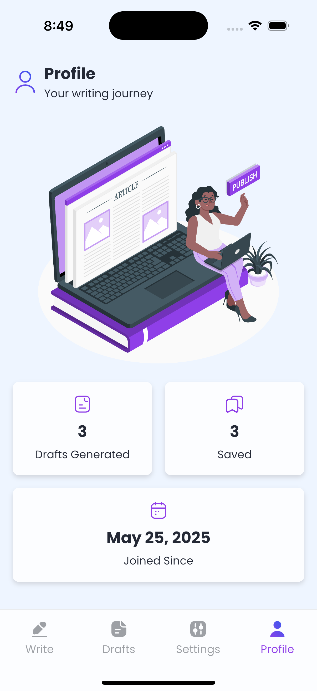

# 🦋 DraftWing

**DraftWing** is an intelligent, agentic mobile application built using [Flutter](https://flutter.dev) and powered by [Vertex AI](https://cloud.google.com/vertex-ai). Designed for developers, writers, and bloggers, DraftWing helps you generate AI-powered drafts that you can validate and publish on platforms like [Medium](https://medium.com), [Dev.to](https://dev.to), or any markdown-supported platform.

## ✨ Name Inspiration

The name **DraftWing** comes from a combination of:

- **"Draft"** – Refers to generating article drafts.
- **"Wing"** – A nod to Flutter, the framework powering this app.

Together, they represent your creative wingman for article generation! 📝🕊️



## 📲 Key Features

DraftWing provides a rich and streamlined drafting experience:

- ✍️ **Generate AI Drafts**: Create article drafts using minimal input with the help of Vertex AI.
- 🔎 **Live Markdown Preview**: View real-time markdown rendering as your draft is built.
- 📋 **Copy Markdown**: Easily copy the complete markdown content or preview version.
- 💾 **Save Locally**: Save drafts on your device for offline use or future reference.
- 🤖 **Smooth AI Flow**: AI interaction is seamless, backgrounded, and non-intrusive.
- 🌗 **Dynamic Theming**: Automatic support for light and dark modes based on system preference.

## 🧠 System Prompt Customization

DraftWing uses a system prompt to instruct the AI. By default, it is optimized for **Flutter**-related articles but you can customize it to your needs.

The current system prompt includes:

```markdown
## Your Capabilities

You are knowledgeable in:

- Flutter and Dart
- Firebase and its ecosystem
- State management (e.g., BLoC, Riverpod, Provider etc.)
- Clean architecture patterns
```

You can modify this in [`assets/prompt.md`](assets/prompt.md) to suit different domains such as web development, mobile strategy, or technical writing.

Reference: [Google Codelab – Flutter + Gemini Colorist](https://codelabs.developers.google.com/codelabs/flutter-gemini-colorist#3)

## 🧑‍💻 Getting Started

To run DraftWing locally on your machine:

### 🔁 Clone the Repository

```bash
git clone https://github.com/ShubhamKrishna0/draftwing.git
cd draftwing
```

### 📦 Install Dependencies

```bash
flutter pub get
```

### 🚀 Launch the App

```bash
flutter run
```

## 🧰 Development Environment

The following environment was used for development and testing:

```
Doctor summary (to see all details, run flutter doctor -v):
[✓] Flutter (Channel stable, 3.29.2, macOS 15.5 darwin-arm64)
[✓] Android SDK (version 34.0.0)
[✓] Xcode (version 16.2)
[✓] Chrome - develop for the web
[✓] Android Studio (version 2024.1)
[✓] VS Code (version 1.99.3)
[✓] Connected device (5 available)
[✓] Network resources

• No issues found!
```

## 🔥 Firebase & Vertex AI Configuration

Since DraftWing integrates Vertex AI via Firebase, you'll need to add your own Firebase config files to run the app.

### 🔧 Steps to Configure Firebase

- **Android**: Add `google-services.json` to `android/app/`
- **iOS**: Add `GoogleService-Info.plist` to `ios/Runner/`

Firebase dependencies and setup are already integrated into the codebase.

> ⚠️ **Warning:** Do not commit your Firebase keys or JSON files to a public repository. Vertex AI usage requires the Blaze billing plan and may incur charges.

## 👁️ UI Showcase

A visual overview of the app interface:

<p float="left">
  
  
  
  
  
  
</p>

## 🧾 License

This project is licensed under the **MIT License**.  
See the [LICENSE](LICENSE.md) file for full license details.

## 🙏 Acknowledgements

- Built using [Flutter](https://flutter.dev)
- AI-powered by [Vertex AI](https://cloud.google.com/vertex-ai)
- Inspired by the creator ecosystem and open-source innovation
- Special thanks to the Flutter community and package maintainers

---

> 💡 Contributions are welcome! Feel free to open an issue, suggest a feature, or submit a pull request.
